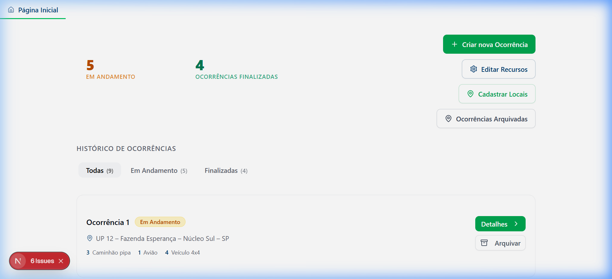
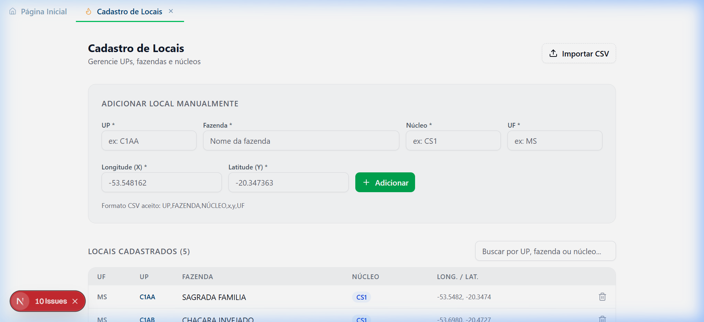

# Teste de Funil — Cadastro de Novo Local

**Tipo de teste:** Tarefa  
**Persona testada:** Márcia Viana — Operadora do Centro de Operações Integradas

---

## Contexto do Projeto

O módulo de **Cadastro de Locais** é a funcionalidade que permite registrar e manter essa base de dados geográficos. Ele é um pré-requisito direto para o funcionamento correto do algoritmo de recomendação de recursos: sem locais cadastrados, o sistema não consegue calcular distâncias nem sugerir a base mais próxima da ocorrência.

---

## Persona Avaliada

### Márcia Viana — Operadora do Centro de Operações Integradas

> *"O que dá segurança para a minha tomada de decisão é ter recomendações objetivas e embasadas que me orientem no momento de escolha."*

| Atributo | Detalhe |
|---|---|
| **Idade** | 37 anos |
| **Cargo** | Operadora do Centro de Operações Integradas — Suzano S.A. |
| **Turno** | 12 horas sob alta pressão operacional |
| **Experiência com tecnologia** | Usuária habituada a sistemas de monitoramento, rádio e planilhas; familiaridade intermediária com interfaces web |
| **Domínio do negócio** | Alto — conhece bem a terminologia florestal (UPs, fazendas, núcleos, bases) |

**Responsabilidades no dia a dia:**
- Monitorar alertas e confirmações de focos de incêndio via câmeras 360°, satélites e WhatsApp
- Verificar se a ocorrência está em área Suzano ou território resiliente
- Decidir qual base acionar e quais recursos mobilizar — atualmente com base em experiência pessoal
- Despachar equipes seguindo protocolo escalonado, equilibrando gravidade, proximidade e disponibilidade de recursos

**Principais dores:**
- Decisões subjetivas dependentes de memória e experiência individual, sem critério padronizado
- Variabilidade entre operadores: o que um operador decide pode ser diferente do que outro decidiria na mesma situação
- Risco de mobilização inadequada — tanto insuficiente (foco avança) quanto excessiva (custo desnecessário)
- Pressão temporal intensa: cada minuto de atraso aumenta a área potencialmente perdida

**Relação com o módulo de Cadastro de Locais:**  
Márcia não é, necessariamente, quem cadastra locais com frequência — isso pode ser feito por coordenadores de campo ou gestores. No entanto, quando uma nova UP entra na área de operação, ou quando uma fazenda muda de nome/código, alguém precisa atualizar o sistema. Em momentos de menor demanda operacional, ela ou um colega pode ser responsável por essa tarefa de atualização cadastral. A **precisão e completude** desse cadastro impactam diretamente a qualidade das recomendações que ela receberá depois.

---

## 1. Tela(s) Analisada(s)

### Tela 1 — Página Inicial (Dashboard)

A tela inicial é o ponto de entrada da plataforma. Apresenta:
- **Contadores de status** das ocorrências: 5 em andamento, 4 ocorrências finalizadas
- **Histórico de ocorrências** com filtros (Todas, Em Andamento, Finalizadas) e acesso a detalhes individuais
- **Botões de ação rápida** na lateral direita: *Criar nova Ocorrência*, *Editar Recursos*, *Cadastrar Locais* e *Ocorrências Arquivadas*

O botão "Cadastrar Locais" está posicionado como terceira opção da coluna de ações, com ícone de mapa (MapPin) e estilo verde — mesmo padrão visual do botão principal da plataforma.

### Tela 2 — Cadastro de Locais

Aba aberta ao clicar em "Cadastrar Locais". Contém dois blocos funcionais:

**Bloco superior — Formulário manual ("Adicionar local manualmente"):**
- Campos obrigatórios (marcados com `*`): **UP**, **Fazenda**, **Núcleo**, **UF**, **Longitude (X)**, **Latitude (Y)**
- Botão verde **"+ Adicionar"** para confirmar o cadastro
- Mensagem de formato CSV aceito: `UP,FAZENDA,NÚCLEO,x,y,UF`
- Botão **"Importar CSV"** no cabeçalho para importação em lote

**Bloco inferior — Tabela de locais cadastrados:**
- Exibe os registros atuais com colunas: UF, UP, Fazenda, Núcleo, Long./Lat.
- Campo de busca por UP, fazenda ou núcleo
- Botão de exclusão (lixeira) por linha

---

## 2. Tipo de Teste

**Tipo:** Tarefa

O teste avalia se a persona (operadora de central com familiaridade com o domínio florestal, mas **sem treinamento prévio na plataforma**) consegue:

1. **Localizar** a entrada para o módulo de cadastro de locais a partir da tela inicial
2. **Compreender** a estrutura hierárquica dos dados (UP → Fazenda → Núcleo → UF) sem auxílio
3. **Executar** o preenchimento correto do formulário e confirmar o registro

O foco está em identificar **barreiras de navegação**, **campos ambíguos** e **pontos de abandono** no fluxo — especialmente porque erros no cadastro comprometem toda a cadeia de recomendações do algoritmo.

---

## 3. Conjunto de Perguntas (Lógica de Funil)

As perguntas seguem a progressão: **abertura ampla → contexto da persona → orientação → execução → reflexão crítica**.

---

### Pergunta 1 — Abertura (Leitura inicial da interface)

> *"Imagine que você é uma operadora de campo e acabou de abrir essa tela pela primeira vez. O que você entende que este sistema faz? Quais ações você acha que consegue realizar aqui?"*

**Objetivo:** Verificar se o propósito central da plataforma (gestão de ocorrências de incêndio) é comunicado com clareza pelos elementos visuais disponíveis — contadores, histórico, botões. Identifica também quais elementos da UI capturam atenção primeiro e se há algum ponto de confusão imediata.

**O que observar:** A persona menciona espontaneamente os botões de ação? Ela nota o "Cadastrar Locais" nesta fase inicial, ou foca apenas em "Criar nova Ocorrência"?

---

### Pergunta 2 — Contexto da Persona (Conexão com o trabalho real)

> *"Você está começando o turno e percebe que algumas UPs novas entraram na área de operação da sua região — elas ainda não estão no sistema. Isso é um problema para você? Por quê?"*

**Objetivo:** Avaliar se a persona compreende a relação entre o cadastro de locais e o funcionamento do algoritmo de recomendações. Como operadora, Márcia depende de locais cadastrados para receber sugestões precisas de qual base acionar. Se ela não percebe essa dependência, o módulo pode parecer "burocrático" e sem urgência.

**O que observar:** A persona verbaliza a consequência operacional da ausência de locais cadastrados? Ela demonstra senso de urgência para manter o cadastro atualizado?

---

### Pergunta 3 — Orientação (Identificar o ponto de entrada)

> *"Você precisa registrar uma dessas UPs novas no sistema agora. Como você faria isso? Por onde começaria?"*

**Objetivo:** Avaliar se o botão "Cadastrar Locais" na página inicial é percebido como o caminho correto, sem nenhuma instrução. Testa a **affordance** do elemento — se o rótulo, ícone e posicionamento comunicam a função com clareza suficiente para orientar a ação.

**O que observar:** A persona encontra o botão com naturalidade ou precisa explorar a interface? Ela hesita entre "Cadastrar Locais" e algum outro botão?

---

### Pergunta 4 — Execução (Realizar a tarefa com dados reais)

> *"Ótimo, você está na tela de Cadastro de Locais. Agora tente registrar esta UP: UP = **'T99'**, Fazenda = **'Fazenda Teste'**, Núcleo = **'CS1'**, UF = **'MS'**, Longitude = **-53.5482**, Latitude = **-20.3474**. Fique à vontade para falar em voz alta o que está pensando enquanto faz isso."*

**Objetivo:** Observar a execução completa do fluxo de cadastro manual. Identificar pontos de fricção como:
- Campos cujos rótulos geram dúvida (ex: "UP" para quem não conhece a sigla)
- Confusão entre Longitude (X) e Latitude (Y) — valores negativos em formato decimal
- Tentativa de preencher campos na ordem "errada" em relação ao layout do formulário
- Reação à validação em caso de campo faltante (mensagem de erro)
- Confirmação visual de que o registro foi adicionado à tabela abaixo

**O que observar:** A persona confirma o sucesso da ação olhando para a tabela? Ela percebe o feedback visual (toast de confirmação)? Ela ficou em dúvida sobre o formato das coordenadas?

---

### Pergunta 5 — Reflexão (Avaliação crítica pós-tarefa)

> *"Você conseguiu cadastrar o local. Pensando na sua rotina operacional: isso é algo que você faria com frequência? Algum campo gerou dúvida? Tem alguma informação que deveria estar aqui e não está — ou algo que te pareceu desnecessário?"*

**Objetivo:** Capturar percepções subjetivas sobre usabilidade e adequação do formulário ao contexto real de trabalho. Identificar:
- Campos que parecem desnecessários na visão da operadora
- Informações que faltam (ex: tipo de vegetação, área em hectares, acessibilidade terrestre)
- Sugestões espontâneas de melhoria
- Percepção sobre se o processo seria viável no ritmo de um turno de 12h sob pressão

---

## 4. Objetivo do Teste

Descobrir se **Márcia Viana** — ou perfis equivalentes de operadoras e coordenadores de campo com domínio florestal, mas sem treinamento prévio no SuzFogo — consegue:

1. **Compreender** a importância do cadastro de locais para o funcionamento do sistema de recomendações
2. **Localizar** a funcionalidade a partir da página inicial sem orientação externa
3. **Executar** o cadastro completo de uma UP de forma correta e autônoma

O resultado do teste deve indicar se os rótulos dos campos, o fluxo de navegação e o feedback visual são suficientes para que a tarefa seja concluída com segurança — sem erros que comprometam a integridade da base geográfica que alimenta o algoritmo.

---

## 5. Ação ou Entendimento Esperado

Ao final do teste, o usuário deve ser capaz de:

1. **Reconhecer** que "Cadastrar Locais" é o ponto de entrada para a funcionalidade, a partir da página inicial, sem instrução explícita
2. **Compreender** a estrutura hierárquica dos dados (UP é uma subdivisão da Fazenda, que pertence a um Núcleo, que está dentro de uma UF/estado)
3. **Preencher corretamente todos os 6 campos obrigatórios** do formulário — UP, Fazenda, Núcleo, UF, Longitude (X) e Latitude (Y) — respeitando o formato numérico das coordenadas
4. **Acionar o botão "+ Adicionar"** e verificar que o novo registro aparece na tabela de locais cadastrados logo abaixo do formulário
5. **Associar** a qualidade do cadastro ao impacto direto nas recomendações do sistema — entendendo que uma UP mal cadastrada ou ausente resulta em sugestões de base incorretas durante uma ocorrência real

---

## Critérios de Sucesso e Fracasso

| Critério | Sucesso | Fracasso |
|---|---|---|
| Localização do módulo | Encontra "Cadastrar Locais" em < 30 segundos | Necessita de orientação ou explora outros botões primeiro |
| Compreensão dos campos | Preenche todos sem pedir explicação sobre algum rótulo | Questiona o significado de "UP", "Núcleo" ou o formato de coordenadas |
| Execução do cadastro | Clica em "+ Adicionar" e o registro aparece na tabela | Clica em "Importar CSV" por engano, ou abandona o formulário |
| Verificação do resultado | Confere na tabela que o local foi adicionado | Não percebe o feedback ou não sabe se a ação foi concluída |
| Associação com impacto | Verbaliza a relação entre cadastro correto e recomendações precisas | Trata o módulo como burocracia desconectada da operação prática |

---
